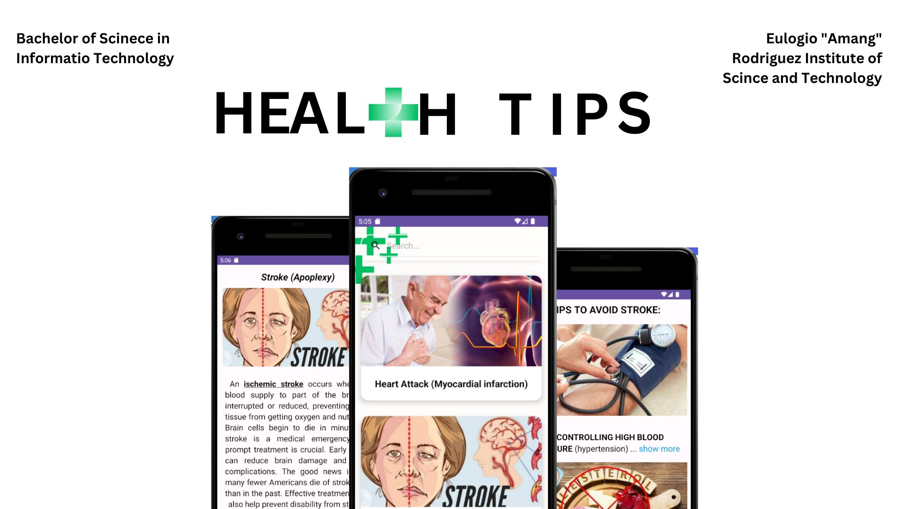
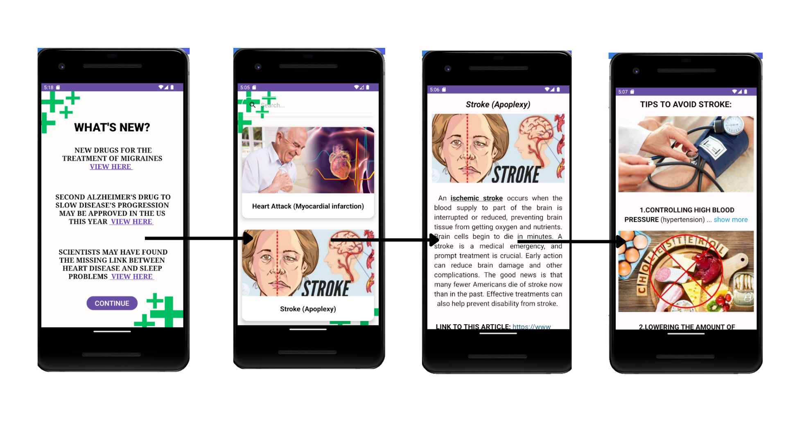

# Health-Tips
Group8 Healt Tips

### Overview
Health Tips is a user-friendly mobile app that provides information about to the diseases and the Tips to avoid it one click you can see the diseases that you choose the description of the diseases of what it is and how can you have it and The 5 tips to the avoid that disease. Health Tips aims to provide information about the diseases to the user and the tips about it so it can help the user to known what they have to do to avoid it.

### Features

  1. What’s New Page: This is the what&#39;s new page which is the first page before the homepage, in what’s new page you can see the title of the articles
and to access the article you need to click the hyperlink of the article which is the View Here after that you can click the continue button to proceed to the homepage or main page

2. Homepage or Main page: This is the homepage or the mainpage of our app. In this main page you can see the picture and name of the diseases. You can search the disease using the search bar, you can search the name of the disease or its scientific name. Click the chosen disease to go to the description and tips page.
   
3. Description page: After you click the cardview of the disease on the homepage you are directed to the disease description which is where you can see the disease and scientific name of the disease and the description of the disease.

4. Tips page: This is the Tips page you can scroll down to see the 5 tips about avoiding the disease you chose, also you can click the showmore to see the full description of the tip you want to see, and click the show less if you don&#39;t want to see the description anymore.

### Demo Video
Click the link to watch [https://drive.google.com/file/d/1fkgW0AcsFEj91U1ifWhp9G5vjo6Xg0Zr/view?usp=sharing](https://drive.google.com/file/d/10jSIiGJOX5yaGwJ4vOatDTtqk2Fkiu8H/view?usp=drive_link)

### Requirements
To run HealthTips on your Android device, ensure the following:
- Android Studio 4.0 (installed on a Mac, Linux, or Windows machine)
- Android device in developer mode with USB debugging enabled
- USB cable (to connect Android device to your computer)

## Contributors
- Watts, Arwin A.
- Regir, Queenie Lyn B.
- Andres, John Myton Kyle
- Go, Annabel R.

## Adviser
- Jefferson A. Costales

### School Information
Eulogio "Amang" Rodriguez Institute of Science and Technology  
Nagtahan, Sampaloc, Manila, Philippines 
College of Arts and Sciences 
ITE Department 

## Course:
Bachelor of Science in Information Technology

### Date
July 31, 2023

Feedback and Support
We value your feedback and strive to enhance the Health Tips app continually. If you encounter any issues, have suggestions for improvement, or need assistance, please reach out to our customer support team at support@healthtipsapp.com.

Thank you for choosing Health Tips We hope the app provide the tips you i want to know.
